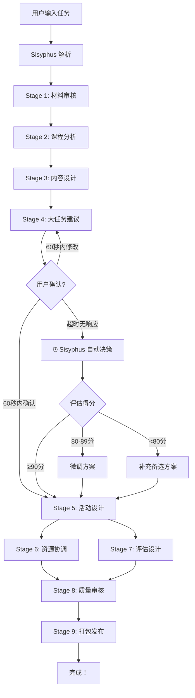

# 智能代理系统架构

## 🎯 总览

本项目使用 **Oh My OpenCode 的 Sisyphus** 作为主调度器，管理小学英语教学设计的完整工作流。

### 架构层次

```
Sisyphus (主调度器)
  ├─ Orchestrator (姜子牙) - 流程管理
  ├─ Curriculum Analyst - 课程分析
  ├─ Content Designer - 内容设计
  ├─ Activity Designer - 活动设计
  ├─ Resource Coordinator - 资源协调
  ├─ Assessment Expert - 评估专家
  ├─ Quality Reviewer - 质量审核
  └─ Package Publisher - 打包发布
```

---

## 🤖 主调度器：Sisyphus

**角色**：Oh My OpenCode 的核心 agent，负责整体任务编排和执行

**职责**：
- ✅ 解析用户输入的任务描述
- ✅ 自动分解为 9 个阶段
- ✅ 按依赖关系调度各个 sub-agents
- ✅ 管理 TODO 列表，确保任务完成
- ✅ 自动选择最佳 AI 模型
- ✅ 处理错误和重试
- ⭐ **超时自动决策**：用户 60 秒未确认时自动评估并继续

**激活方式**：
```
ulw Design lesson: [主题], [年级], [教材版本]
```

**配置**：
- 模型：`openrouter/anthropic/claude-3.5-sonnet`
- 工具：read, write, edit, bash
- 启用 TODO 强制执行
- **自动决策**：用户确认超时 60 秒后自动评估并继续

**⏱️ 自动决策机制**：

当阶段 4（Big Task Proposal）需要用户确认时：

1. ⏰ **等待 60 秒**：给用户充足时间查看和确认
2. 🤖 **自动评估**：超时后 Sisyphus 自动评估提案质量（0-100 分）
3. 🎯 **智能决策**：
   - **得分 ≥ 90**：直接进入下一阶段（提案优秀）
   - **得分 80-89**：微调后进入下一阶段（提案良好）
   - **得分 < 80**：补充备选方案后进入下一阶段（需改进）
4. 📝 **记录日志**：所有决策记录到 `state/DECISION_LOG.md`

**评估维度**：
- 教学目标对齐度（30%）
- 学生能力匹配度（30%）
- 任务可行性（25%）
- 创新性与趣味性（15%）

详见：[AUTO_DECISION_MECHANISM.md](AUTO_DECISION_MECHANISM.md)

---

## 👥 Sub-Agents（子代理）

### 1. Orchestrator（姜子牙）- 流程管理器

**职责**：
- 材料审核和准备
- 流程协调
- 状态管理
- 用户确认管理

**模型**：`openrouter/google/gemini-pro-1.5`（大文件处理）

**输入**：用户需求、materials/ 文件夹
**输出**：`state/MATERIAL_AUDIT.md`

---

### 2. Curriculum Analyst - 课程分析师

**职责**：
- 分析课程标准
- 确定教学目标
- 分析学情特点
- 识别重难点

**模型**：`openrouter/anthropic/claude-3.5-sonnet`

**输入**：材料审核结果、教材内容
**输出**：`state/CURRICULUM_ANALYSIS.md`

---

### 3. Content Designer - 内容设计师

**职责**：
- 设计核心任务
- 准备语言工具
- 规划教学流程
- 设计教学策略

**模型**：`openrouter/anthropic/claude-3.5-sonnet`

**输入**：课程分析结果
**输出**：`state/CONTENT_DESIGN.md`

---

### 4. Activity Designer - 活动设计师

**职责**：
- 提出核心大任务建议
- 设计活动链
- 设计 Pre/While/Post-task
- 设计互动环节

**模型**：`openrouter/anthropic/claude-3.5-sonnet`

**输入**：内容设计方案
**输出**：
- `state/BIG_TASK_PROPOSAL.md`（需用户确认）
- `state/ACTIVITY_DESIGN.md`

**特殊**：阶段 4 完成后暂停，等待用户确认

---

### 5. Resource Coordinator - 资源协调员

**职责**：
- 整理教学资源清单
- 确定资源来源
- 记录版权信息
- 协调资源获取

**模型**：`openrouter/anthropic/claude-3-haiku`（快速）

**输入**：活动设计方案
**输出**：
- `state/RESOURCE_LIST.md`
- `state/SOURCES.md`

---

### 6. Assessment Expert - 评估专家

**职责**：
- 设计评估标准
- 设计练习题
- 设计评分细则
- 设计形成性评价

**模型**：`openrouter/anthropic/claude-3.5-sonnet`

**输入**：内容设计、活动设计
**输出**：`state/ASSESSMENT_DESIGN.md`

---

### 7. Quality Reviewer - 质量审核员

**职责**：
- 全面审核设计文档
- 检查一致性
- 识别问题
- 提出改进建议

**模型**：`openrouter/anthropic/claude-3.5-sonnet`

**输入**：所有前序阶段文档
**输出**：`state/QUALITY_REVIEW.md`

---

### 8. Package Publisher - 打包发布专家

**职责**：
- 生成完整教案
- 生成学生材料
- 生成交付清单
- 生成使用说明

**模型**：`openrouter/anthropic/claude-3-haiku`（快速）

**输入**：所有设计文档
**输出**：
- `draft/lesson_plan.md`（主教案）
- `draft/student_preview_guide.md`（预习清单）
- `draft/homework_sheet.md`（作业纸）
- `draft/PACKAGE_CHECKLIST.md`
- `draft/USAGE_GUIDE.md`

---

## 📊 工作流程



---

## 🎮 调度机制

### Sisyphus 如何调度

1. **任务分解**：
   - 读取 AGENTS.md（本文件）
   - 理解 9 个阶段的依赖关系
   - 创建 TODO 列表

2. **模型选择**：
   - 根据任务类型自动选择最佳模型
   - 材料审核 → Gemini Pro 1.5（长上下文）
   - 分析设计 → Claude 3.5 Sonnet（推理）
   - 快速整理 → Claude 3 Haiku（速度）

3. **执行管理**：
   - 按依赖顺序执行阶段
   - 阶段 4 暂停等待用户确认
   - 自动记录日志到 `state/LOG.md`
   - 处理错误和重试

4. **质量保证**：
   - TODO 强制执行（必须完成才能继续）
   - 注释检查（清理无用注释）
   - 输出验证（确保文件生成）

---

## 🔧 配置文件

### 1. opencode.json
- 定义 providers 和 models
- 启用 oh-my-opencode 插件
- 配置 task routing

### 2. .opencode/oh-my-opencode.json
- 配置 Sisyphus 和其他 agents
- 启用 background agents
- 启用 productivity features

---

## 📝 使用示例

### 启动任务

```bash
# 1. 启动 OpenCode
opencode

# 2. 输入任务（ulw = ultrawork，激活 Sisyphus）
ulw Design lesson: Unit 1 Goldilocks and the three bears, 五年级, 译林版

Execute 9-stage workflow, pause at stage 4 for confirmation.
```

### Sisyphus 自动执行

```
[Sisyphus] Task received: Design lesson for Unit 1 Goldilocks...
[Sisyphus] Creating TODO list with 9 stages
[Sisyphus] Reading AGENTS.md for architecture context
[Sisyphus] Stage 1/9: Material Intake
[Sisyphus] → Selecting model: google/gemini-pro-1.5 (long context)
[Sisyphus] → Scanning materials/ folder
[Sisyphus] → Generating state/MATERIAL_AUDIT.md
[Sisyphus] ✓ Stage 1 complete

[Sisyphus] Stage 2/9: Curriculum Analysis
[Sisyphus] → Selecting model: anthropic/claude-3.5-sonnet (reasoning)
...

[Sisyphus] Stage 4/9: Big Task Proposal
[Sisyphus] → Generating state/BIG_TASK_PROPOSAL.md
[Sisyphus] ⏸️  PAUSING for user confirmation

【核心大任务建议】
续写 Goldilocks 故事并角色扮演

Please confirm (1) or modify (2): _
```

---

## 🎯 关键优势

### 使用 Sisyphus 调度的好处

1. ✅ **自动化**：不需要手动调用每个 agent
2. ✅ **智能**：自动选择最佳模型
3. ✅ **可靠**：TODO 强制执行，确保完成
4. ✅ **可观察**：自动记录日志和进度
5. ✅ **灵活**：支持修改和重试

### 与传统方式对比

**传统方式**：
```bash
python tools/run_stage.py --stage material_intake
python tools/run_stage.py --stage curriculum_analysis
python tools/run_stage.py --stage content_design
...
```

**使用 Sisyphus**：
```bash
ulw Design lesson: [主题], [年级], [教材]
```

一行命令，自动完成所有！

---

## 📚 参考文档

- [Oh My OpenCode GitHub](https://github.com/code-yeongyu/oh-my-opencode)
- [OpenCode 官方文档](https://opencode.ai)
- 项目启动指南：`START_NOW.md`
- 配置说明：`CORRECT_STARTUP_PROCESS.md`
