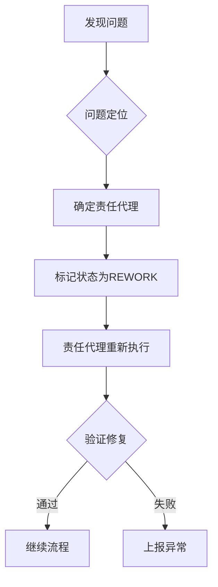

# 代理交接协议 - 严格规范

## 一、交接物规范

每个代理必须产出标准化交接物，不允许任何歧义或缺失。

### 1. Stylist → Coordinator 交接清单

**必须产出（缺一不可）**：
```yaml
交接物:
  - file: state/STYLE_PROFILE.md
    status: COMPLETED  # 仅允许 COMPLETED 或 BLOCKED
    version: v1.2
    checksum: md5_hash
  - file: state/WRITING_SPEC.md
    status: COMPLETED
    updates:
      - 3000字要求: CONFIRMED
      - 段落数量: 16段
      - 设问数量: 10-15个
      - 第二人称: 最少20次

验证项:
  - 风格缓存是否有效: YES/NO（不允许"可能"）
  - 是否需要刷新: YES/NO
  - 阻塞项: NONE 或具体描述

责任签名: stylist_20250118_1000UTC
```

### 2. Coordinator → Researcher 交接清单

**必须产出**：
```yaml
交接物:
  - file: state/MATERIAL_AUDIT.md
    内容完整性:
      - 主题定义: COMPLETE
      - 素材清单: COMPLETE
      - 缺口分析: COMPLETE
      - 外部调研权限: ALLOWED/FORBIDDEN（二选一）

  - file: state/PUBLISH_PLAN.md
    里程碑:
      - M1_截止时间: YYYY-MM-DD HH:MM UTC
      - M2_截止时间: YYYY-MM-DD HH:MM UTC
      - 风险等级: LOW/MEDIUM/HIGH
      - 缓解措施: 具体描述

验证项:
  - 所有必填字段是否完整: YES（不允许NO）
  - 是否有未定义项: NO（必须为NO）

责任签名: coordinator_20250118_1015UTC
```

### 3. Researcher → Outliner 交接清单

**必须产出**：
```yaml
交接物:
  - file: state/RESEARCH_SUMMARY.md
    数据完整性:
      - 官方资料: ≥3条 或 NOT_AVAILABLE
      - 社区反馈: ≥3条 或 NOT_AVAILABLE
      - 数据支撑: ≥2条 或 NOT_AVAILABLE
      - 总链接数: 具体数字（不允许"约"）

  - file: state/SOURCES.md
    每条来源必须包含:
      - 标题: 不为空
      - URL: 有效链接（已验证）
      - 日期: YYYY-MM-DD格式
      - 可访问性: VERIFIED

验证项:
  - 所有链接是否验证: 100%完成
  - 是否有待补充项: NO（必须完成）

责任签名: researcher_20250118_1030UTC
```

### 4. Outliner → Writer 交接清单

**必须产出**：
```yaml
交接物:
  - file: state/POST_OUTLINE.md
    结构定义:
      - 段落总数: 16（固定）
      - 每段字数: 150-200（不允许"大概"）
      - 可视化需求:
          P3: Mermaid流程图（具体类型）
          P7: 数据表格（3列5行）
          P10: 无需图片
      - 引用分配:
          每段引用数: 具体数字
          总引用数: 具体数字

验证项:
  - 字数是否可达3000+: CONFIRMED
  - 结构是否完整: YES
  - 是否有模糊指示: NO（全部明确）

责任签名: outliner_20250118_1045UTC
```

### 5. Writer → Editor 交接清单

**必须产出**：
```yaml
交接物:
  - file: state/POST.md
    完成度:
      - 实际字数: 3050（精确数字）
      - 实际段落: 16
      - 设问数量: 12（精确统计）
      - 第二人称: 23次（精确统计）

  - file: draft/post.md
    状态: READY_FOR_REVIEW

  - 可视化实现:
      Mermaid图表: 3个
      数据表格: 2个
      用户图片: 0个
      占位符: 0个

验证项:
  - 是否达到3000字: YES
  - 是否所有引用有效: YES
  - 是否有未完成项: NO

责任签名: writer_20250118_1100UTC
```

### 6. Editor → Publisher 交接清单

**必须产出**：
```yaml
审核结果:
  - 风格一致性: PASS/FAIL（二选一）
  - 事实准确性: PASS/FAIL
  - 字数要求: PASS/FAIL
  - 可视化质量: PASS/FAIL

  修改要求:（如有）
    - 位置: 第X段第Y行
    - 原文: "精确引用"
    - 修改为: "精确修改"
    - 原因: 具体说明

验证项:
  - 是否可发布: YES/NO
  - 阻塞原因: NONE 或具体描述

责任签名: editor_20250118_1115UTC
```

## 二、返工机制

### 触发条件（任一满足即触发）

1. **硬性失败**：
   - 字数不足3000
   - 必需文件缺失
   - 验证项包含NO

2. **质量失败**：
   - Editor标记FAIL
   - Publisher发现致命问题

### 返工流程



### 返工记录格式

```yaml
返工单号: RW_20250118_001
触发位置: editor
问题描述: 字数仅2800，未达标
责任代理: writer
返工状态: IN_PROGRESS
开始时间: 2025-01-18 11:20 UTC
预计完成: 2025-01-18 11:40 UTC
实际完成: 待定
验证人: editor
```

## 三、状态机更新

在 `state/STATUS.yaml` 中增加：

```yaml
agents:
  stylist:
    status: COMPLETED  # WAITING/IN_PROGRESS/COMPLETED/BLOCKED/REWORK
    last_run: 2025-01-18 10:00 UTC
    output_verified: true
    signature: stylist_20250118_1000UTC

  coordinator:
    status: COMPLETED
    last_run: 2025-01-18 10:15 UTC
    output_verified: true
    signature: coordinator_20250118_1015UTC
    dependencies:
      - stylist: VERIFIED

  # ... 其他代理类似

rework_history:
  - id: RW_20250118_001
    agent: writer
    reason: 字数不足
    status: RESOLVED
```

## 四、验证检查点

### 自动验证（必须通过）

```python
def validate_handoff(from_agent, to_agent, handoff_data):
    """
    返回: (bool, error_message)
    """
    # 1. 文件存在性
    for file in handoff_data['files']:
        if not os.path.exists(file['path']):
            return False, f"Missing file: {file['path']}"

    # 2. 必填字段
    for field in handoff_data['required']:
        if field['value'] in [None, "", "TODO", "待定"]:
            return False, f"Undefined field: {field['name']}"

    # 3. 数值精确性
    for metric in handoff_data['metrics']:
        if "约" in str(metric['value']) or "左右" in str(metric['value']):
            return False, f"Imprecise value: {metric['name']}"

    # 4. 签名验证
    if not handoff_data.get('signature'):
        return False, "Missing agent signature"

    return True, "Validation passed"
```

## 五、禁止的模糊表达

**绝对禁止使用**：
- "大概"、"约"、"左右"、"可能"
- "建议"、"或许"、"也许"
- "TODO"（除非在明确的待办清单中）
- "待补充"、"待定"
- "如需"、"可选"（必须明确YES/NO）

**必须使用**：
- 精确数字：3050字（不是"3000字左右"）
- 明确状态：COMPLETED/BLOCKED（不是"基本完成"）
- 具体时间：2025-01-18 10:00 UTC（不是"上午"）
- 二选一：YES/NO、PASS/FAIL、TRUE/FALSE

## 六、异常处理

### 阻塞上报格式

```yaml
异常报告:
  代理: writer
  时间: 2025-01-18 11:30 UTC
  类型: HARD_BLOCK  # HARD_BLOCK/SOFT_BLOCK
  描述: 无法达到3000字要求，素材不足
  尝试方案:
    1. 已尝试扩展案例（增加500字）
    2. 已尝试深入分析（增加300字）
    3. 仍差200字
  建议: 需要researcher补充2个案例
  影响: 延迟发布2小时
```

### 降级方案

仅在极端情况下允许降级：
1. 3000字降级到2800字：需要用户明确批准
2. 16段降级到14段：需要用户明确批准
3. Mermaid图表降级到文字描述：自动降级但需记录

## 七、审计追踪

每个代理必须在 `state/LOG.md` 中留下完整审计记录：

```markdown
===== 2025-01-18 11:00:00 UTC | Writer 交接 =====
【交接前自检】
□ 字数达标：3050字 ✓
□ 段落完整：16段 ✓
□ 设问数量：12个 ✓
□ 引用有效：100% ✓

【交接物清单】
- state/POST.md (md5: abc123)
- draft/post.md (md5: def456)

【验证结果】
自动验证：PASS
人工复核：PASS

【正式交接】
FROM: writer_20250118_1100UTC
TO: editor
STATUS: VERIFIED
=====
```

这样可确保：
1. 任何问题都能追溯到具体责任人
2. 返工从准确位置开始，不重复工作
3. 交接物明确，无歧义空间
4. 状态实时更新，支持并行和异步处理
