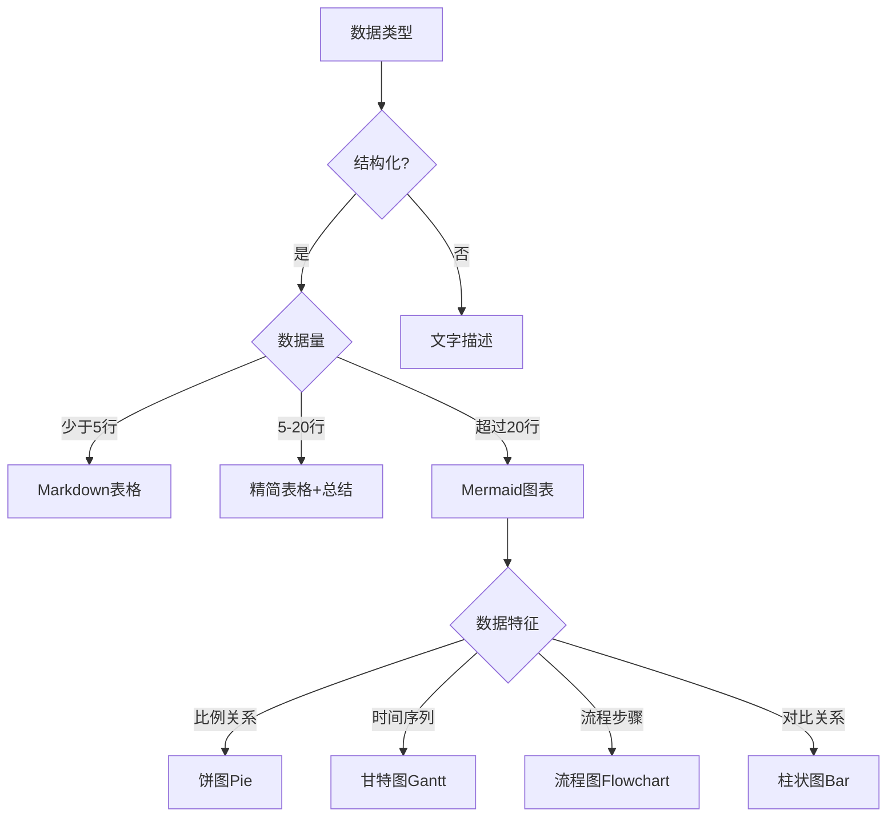
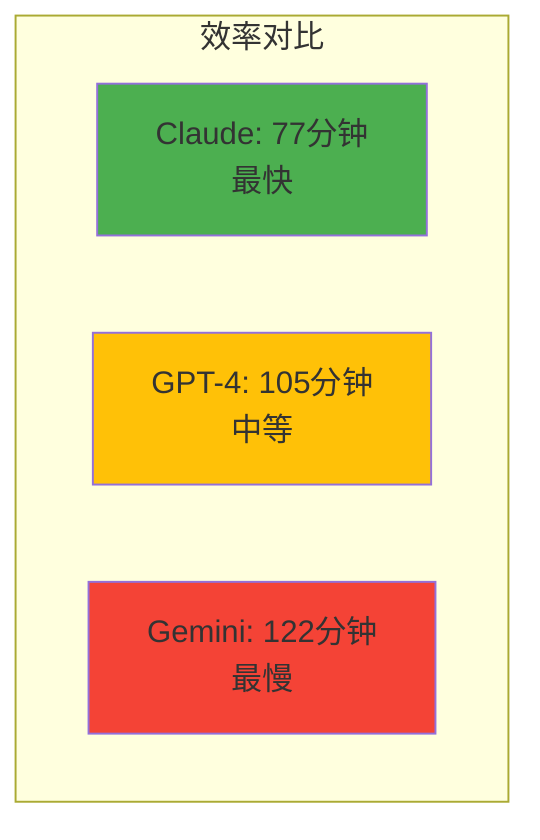
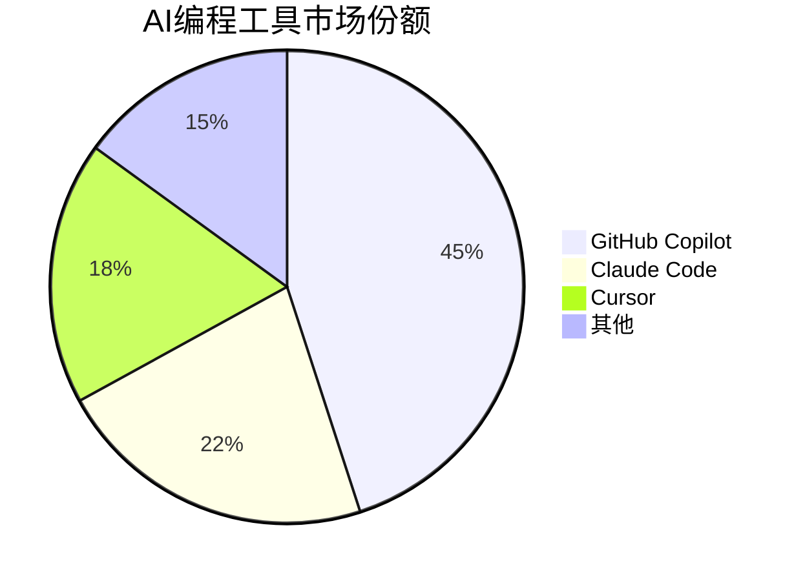
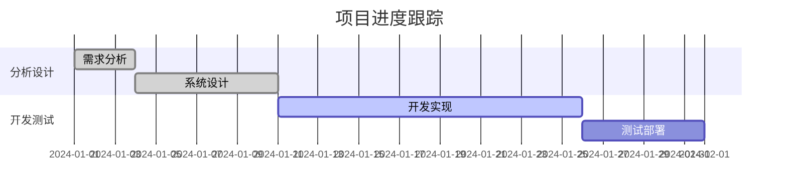
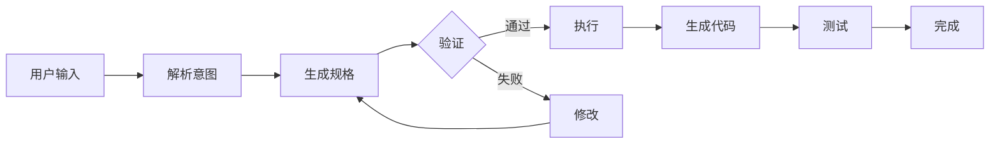
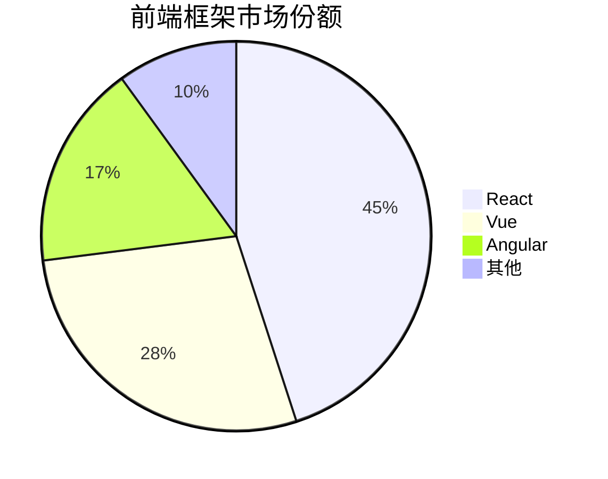

# 数据可视化指南

## 核心原则
根据数据类型和数量选择最合适的展示方式，优先考虑可读性和理解成本。

## 可视化决策树



## 具体应用场景

### 1. 性能对比数据

**原始数据**：
```
Claude Code: 耗时1小时17分，费用$4.80
Gemini CLI: 耗时2小时2分，费用$7.06
GPT-4: 耗时1小时45分，费用$5.50
```

**表格展示**（数据少，适合表格）：
| 工具 | 耗时 | 费用 |
|------|------|------|
| Claude Code | 1h 17m | $4.80 |
| Gemini CLI | 2h 02m | $7.06 |
| GPT-4 | 1h 45m | $5.50 |

**Mermaid图表**（强调对比）：


### 2. 市场份额数据

**原始数据**：
```
GitHub Copilot: 45%
Claude Code: 22%
Cursor: 18%
Others: 15%
```

**Mermaid饼图**（展示占比）：


### 3. 项目进度数据

**原始数据**：
```
需求分析: 1/1-1/3 (完成)
系统设计: 1/4-1/10 (完成)
开发实现: 1/11-1/25 (进行中)
测试部署: 1/26-1/31 (计划)
```

**Mermaid甘特图**（展示时间线）：


### 4. 复杂流程数据

**原始数据**：
```
用户输入 -> 解析意图 -> 生成规格
规格 -> 验证 -> 通过则执行，不通过则修改
执行 -> 生成代码 -> 测试 -> 完成
```

**Mermaid流程图**（展示逻辑）：


## Writer代理使用指南

### 数据识别与处理

1. **扫描数据特征**
   ```markdown
   【内心独白】
   "这段有3个工具的性能对比数据...
   数据量不大，但对比关系明显，
   适合用表格，再配个简单的对比图突出差异。"
   ```

2. **选择可视化方式**
   - 3-5条数据：简洁表格
   - 流程关系：Mermaid flowchart
   - 时间进度：Mermaid gantt
   - 比例分布：Mermaid pie
   - 系统架构：Mermaid class

3. **生成图表代码**
   ```markdown
   根据上面的测试数据，我们可以看出效率差异：

   ```mermaid
   graph LR
       A[最快: Claude 77分钟]
       B[中等: GPT-4 105分钟]
       C[最慢: Gemini 122分钟]

       A -.->|快28分钟| B
       B -.->|快17分钟| C
   ```

### 图表前后文说明

**前置说明**：解释数据来源和意义
```markdown
我们对三款主流AI编程工具进行了相同任务的测试，
记录了完成时间和产生的费用：
```

**后置解读**：分析数据insights
```markdown
从图表可以看出，Claude Code在速度和成本上都有优势，
但这并不意味着它适合所有场景...
```

## 数据处理示例

### 用户提供Excel数据
```python
# 假设用户提供了sales_data.xlsx
# Writer代理的处理思路：

【内心独白】
"用户给了销售数据Excel，有12个月的数据...
可以提取关键指标做可视化：
1. 月度趋势 - 用Mermaid折线图
2. 季度对比 - 用表格
3. 增长率 - 用文字强调关键数字"
```

### 用户提供JSON数据
```json
{
  "frameworks": [
    {"name": "React", "stars": 218000, "usage": "45%"},
    {"name": "Vue", "stars": 206000, "usage": "28%"},
    {"name": "Angular", "stars": 93000, "usage": "17%"}
  ]
}
```

Writer处理：
```markdown
前端框架的受欢迎程度对比：

| 框架 | GitHub Stars | 市场使用率 |
|------|-------------|------------|
| React | 218k | 45% |
| Vue | 206k | 28% |
| Angular | 93k | 17% |



## 注意事项

1. **适度原则**：不要过度可视化，文字能说清楚的不必图表
2. **统一风格**：全文图表风格保持一致
3. **移动友好**：考虑手机端显示效果
4. **备选方案**：复杂图表提供文字版说明
5. **数据准确**：确保数据来源可靠，标注出处

## 常见错误

❌ **错误示例**：
- 2-3个数据点也做复杂图表
- 图表无说明，读者看不懂
- 数据过多，图表太复杂
- 颜色、样式不一致

✅ **正确做法**：
- 简单数据用简单展示
- 图表前后都有文字说明
- 复杂数据做适当聚合
- 保持视觉风格统一
