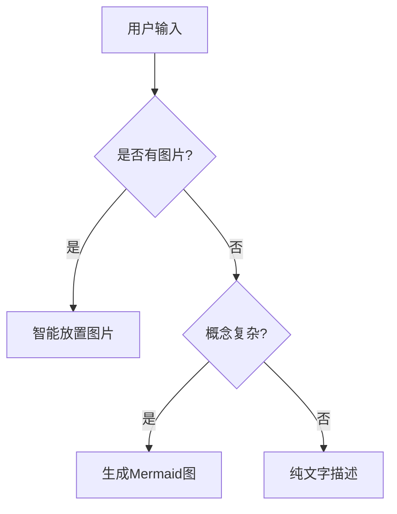
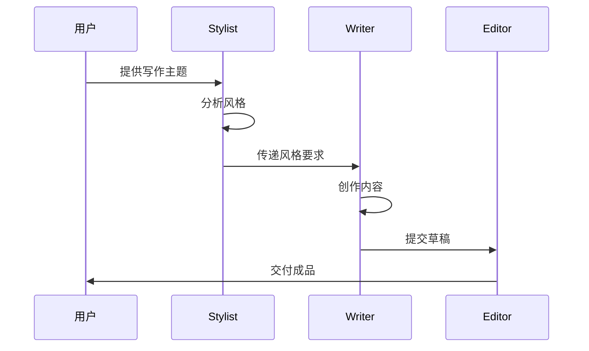
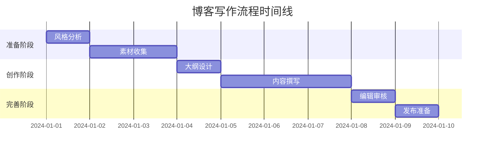
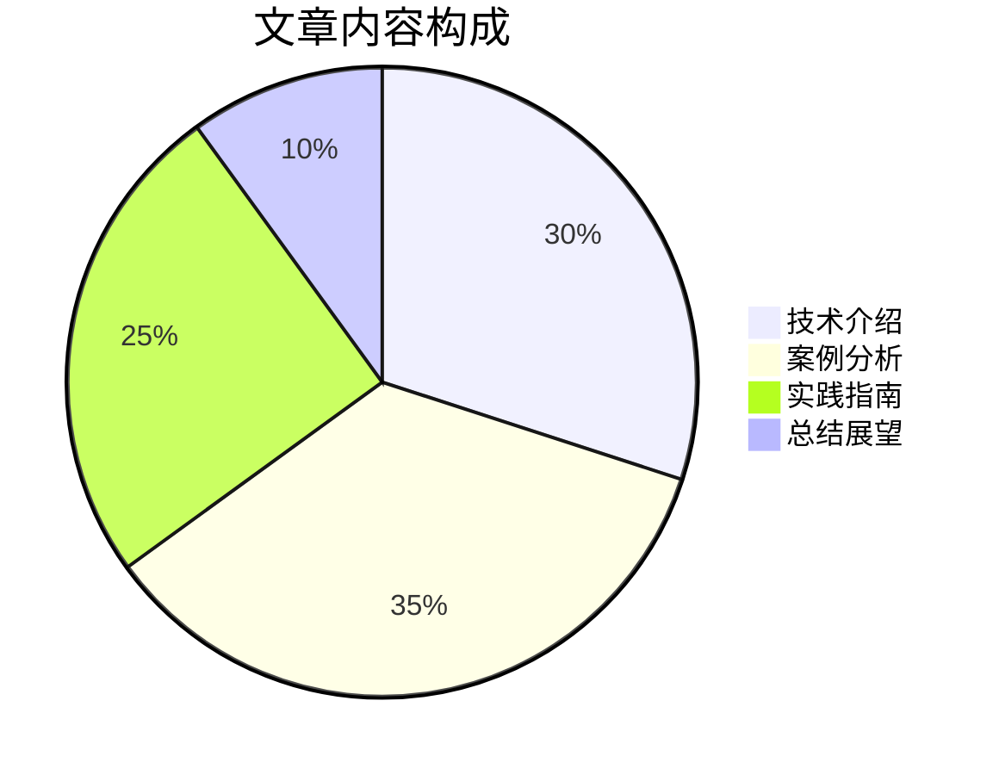
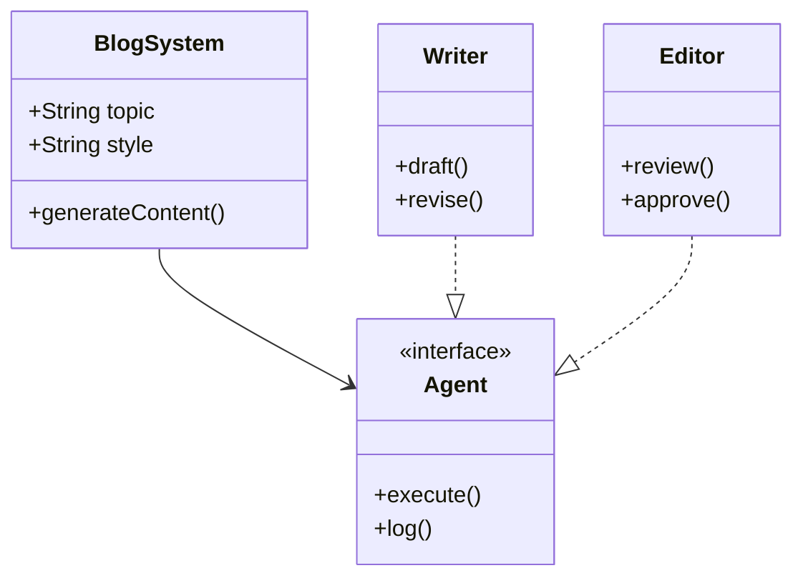
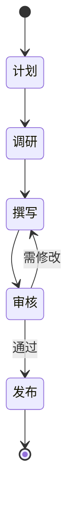
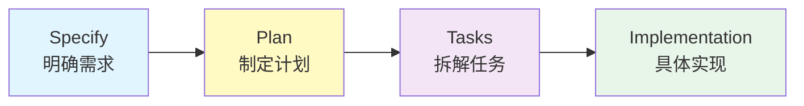
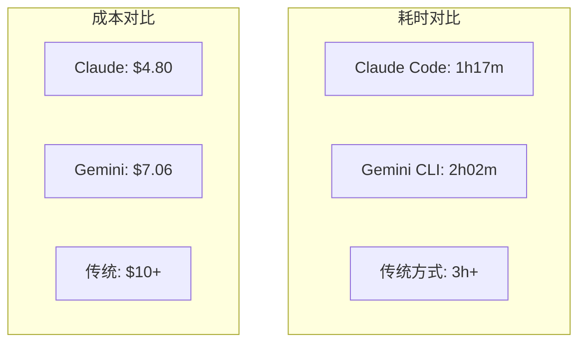
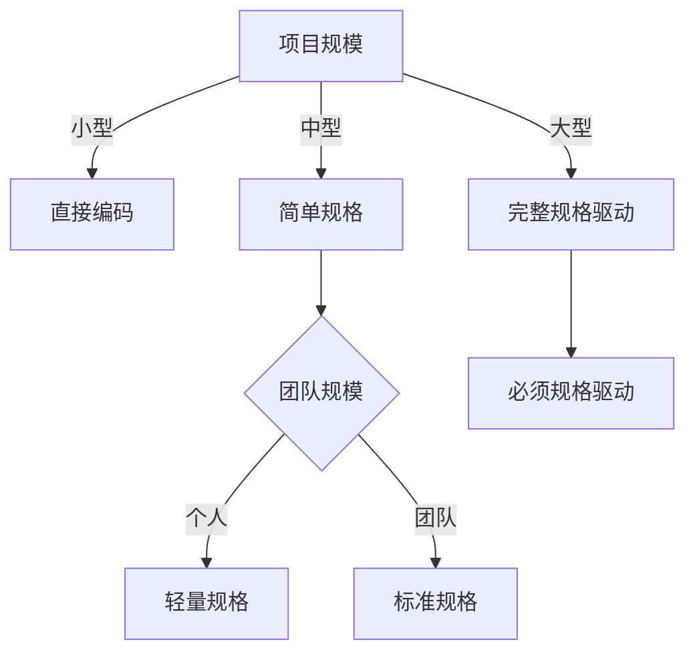

# Mermaid图表使用指南

## 概述
Mermaid是一种基于文本的图表生成工具，可以直接在Markdown中创建各种图表，无需外部工具或图片文件。

## 适用场景与图表类型

### 1. 流程图（Flowchart）
用于展示步骤、决策流程、工作流



### 2. 时序图（Sequence Diagram）
用于展示交互过程、API调用、代理协作



### 3. 甘特图（Gantt Chart）
用于展示项目进度、时间安排



### 4. 饼图（Pie Chart）
用于展示比例、分布、构成



### 5. 类图（Class Diagram）
用于展示系统架构、模块关系



### 6. 状态图（State Diagram）
用于展示状态转换、生命周期



## 使用原则

### 何时使用Mermaid
1. **流程说明**：多步骤的操作流程
2. **架构展示**：系统组件关系
3. **数据对比**：比例、分布数据
4. **时间顺序**：事件发展、交互过程
5. **状态变化**：状态机、生命周期

### 何时不使用
1. **简单概念**：一两句话能说清楚的
2. **纯数据**：适合表格展示的
3. **UI界面**：需要截图的
4. **艺术配图**：需要美观装饰的

## 在博客中的应用示例

### 技术流程图
```markdown
下面是规格驱动开发的四个阶段：



### 性能对比图
```markdown
不同AI工具的效率对比：



### 决策流程
```markdown
选择开发方式的决策树：



## 最佳实践

1. **保持简洁**：图表应该辅助理解，不要过于复杂
2. **统一风格**：全文图表风格保持一致
3. **适度使用**：每篇文章2-4个图表为宜
4. **配合文字**：图表前后要有说明文字
5. **响应式考虑**：确保移动端也能正常显示

## 代理使用指导

### Writer代理
- 识别复杂概念，主动使用Mermaid图表
- 每个图表前后加说明文字
- 图表复杂度适中（5-10个节点）

### Editor代理
- 检查图表是否有助于理解
- 确认图表语法正确
- 评估是否需要简化或拆分

### Publisher代理
- 验证Mermaid代码块正确渲染
- 确保发布平台支持Mermaid
- 必要时提供PNG备选方案

## 常见错误与解决

1. **语法错误**：使用在线编辑器预览
2. **过于复杂**：拆分成多个小图
3. **文字过长**：使用缩写或分行
4. **样式不一致**：定义统一的样式模板
5. **渲染失败**：检查特殊字符转义
