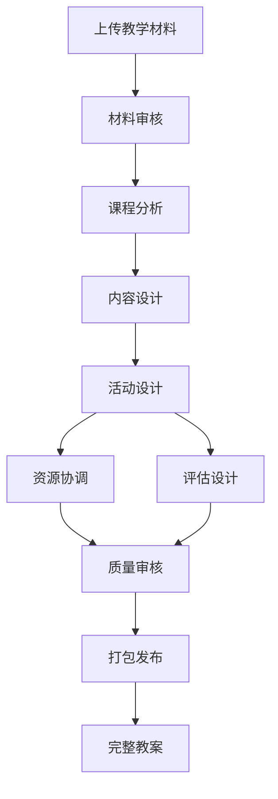

# 小学英语教学设计系统

> **v2.5.0** - 基于 **Oh My OpenCode + Sisyphus** 的智能教学设计系统，一行命令生成完整教案

## 🚀 立即开始（2步）

### 1. 启动系统
```powershell
cd 'C:\Users\Administrator\Desktop\myproject\eeld-top-down'
.\.opencode\start-ohmyopencode.bat
```

### 2. 输入任务
```
ulw Design lesson: Unit 1 Goldilocks, 五年级, 译林版
```

**完成！** Sisyphus 会自动执行 9 个阶段，15 分钟后生成完整教案 ✨

---

## 📚 文档导航

**新用户？选择你的起点**：
- 📖 [立即开始](START_NOW.md) - 最简单的启动方式（推荐）
- 📖 [快速指南](QUICK_START.md) - 3秒理解系统
- 📖 [系统架构](AGENTS.md) - Sisyphus 如何调度 agents
- 📖 [项目信息](PROJECT_INFO.md) - 完整项目说明
- 📖 [详细配置](CORRECT_STARTUP_PROCESS.md) - 高级用户

---

## ✨ 核心特性

### 🚀 超级自动化 ⭐新架构
- **Sisyphus 主调度器** - Oh My OpenCode 核心 agent
- 一行命令启动，自动执行 9 个阶段
- 智能模型选择（Gemini/Claude）
- TODO 强制执行，确保完成
- 自动错误处理和重试

### 🤖 8个专业 Sub-Agents
1. **Orchestrator（姜子牙）** - 流程管理和材料审核
2. **Curriculum Analyst** - 课程分析
3. **Content Designer** - 内容设计
4. **Activity Designer** - 活动设计（含大任务建议）
5. **Resource Coordinator** - 资源协调
6. **Assessment Expert** - 评估设计
7. **Quality Reviewer** - 质量审核
8. **Package Publisher** - 打包发布

### 🎯 基于真实教材设计
- 支持上传教材（学生用书、教师用书）
- 支持上传课程标准和参考资料
- 自动扫描和审核材料（Gemini Pro 1.5）
- 基于真实材料进行教学设计

### 📦 完整交付物
- 完整教案（包含教学过程、板书设计等）
- **学生预习清单**（具体可操作的预习任务）⭐新增
- **家庭作业纸**（可打印的练习题）⭐新增
- 课程分析报告
- 内容设计方案
- 活动设计方案
- 资源清单
- 评估设计方案
- 质量审核报告
- 使用说明

## 🎓 教学理念

基于 **"任务驱动、自上而下学习法"**：
- ✅ 真实任务驱动
- ✅ 完整学习过程
- ✅ 有形学习成果
- ✅ 真实交际目的
- ✅ 单一核心聚焦

---

## 📊 使用流程

### 步骤1：准备教学材料（可选）

将教学材料放入对应文件夹：

```
materials/
├── textbooks/          # 教材文件
│   ├── student_book/   # 学生用书
│   └── teacher_book/   # 教师教学用书
├── standards/          # 课程标准
└── reference/          # 参考资料
```

**支持格式**：PDF、Word (.doc, .docx)、TXT、Markdown

**示例文件名**：
- `人教版PEP三年级上册_学生用书.pdf`
- `义务教育英语课程标准2022版.pdf`
- `小学英语课堂游戏100例.docx`

### 步骤2：启动设计流程

使用命令：
```
/start-lesson-design <主题> <年级> <教材>
```

**示例**：
```
/start-lesson-design Animals 四年级 人教版PEP
/start-lesson-design My_Family 三年级 外研版
/start-lesson-design Colors 三年级 人教版PEP
```

### 步骤3：等待生成

系统将自动完成以下流程：
1. **材料审核** - 扫描并分析上传的材料
2. **课程分析** - 基于教材和课程标准分析
3. **内容设计** - 设计知识点呈现方式
4. **活动设计** - 设计课堂活动
5. **资源协调** - 整理教学资源
6. **评估设计** - 设计评估方式
7. **质量审核** - 全面审核质量
8. **打包发布** - 生成完整教案
9. **学生材料** - 生成预习清单和作业纸 ⭐新增

## 📂 项目结构

```
elementary-english-lesson-designer/
├── materials/              # 教学材料（用户上传）⭐新增
│   ├── textbooks/         # 教材
│   ├── standards/         # 课程标准
│   └── reference/         # 参考资料
├── state/                 # 状态和设计文档
│   ├── MATERIAL_AUDIT.md  # 材料审核报告 ⭐新增
│   ├── CURRICULUM_ANALYSIS.md
│   ├── CONTENT_DESIGN.md
│   ├── ACTIVITY_DESIGN.md
│   ├── RESOURCE_LIST.md
│   ├── ASSESSMENT_DESIGN.md
│   ├── QUALITY_REVIEW.md
│   ├── STATUS.yaml        # 状态机
│   └── LOG.md            # 工作日志
├── draft/                      # 最终交付物
│   ├── lesson_plan.md         # 完整教案（主要交付物）
│   ├── student_preview_guide.md # 学生预习清单 ⭐新增
│   ├── homework_sheet.md      # 家庭作业纸 ⭐新增
│   ├── PACKAGE_CHECKLIST.md
│   └── USAGE_GUIDE.md
├── assets/               # 教学资源
├── samples/              # 示例教学设计
└── .claude/              # 代理配置
    ├── agents/           # 各代理配置文件
    └── commands/         # 命令配置
```

## 🎓 支持的教材版本

- **人教版PEP** (人民教育出版社)
- **外研版** (外语教学与研究出版社)
- **译林版** (译林出版社)
- **北师大版** (北京师范大学出版社)
- **冀教版** (河北教育出版社)
- **湘少版** (湖南少年儿童出版社)

## 📋 教学设计规范

系统遵循以下规范：
- 《义务教育英语课程标准》（2022年版）
- 英语学科核心素养框架
- 小学英语教学大纲
- 各年级分级目标体系

## 🔍 工作流程



## 📊 质量保证

### 守门条件
- ✅ 材料审核：至少有教材或课程标准
- ✅ 课程分析：基于真实材料完成分析
- ✅ 内容设计：紧扣教学目标和教材内容
- ✅ 活动设计：层次分明、可操作
- ✅ 资源准备：清单完整且可获取
- ✅ 评估设计：与教学目标完全对齐
- ✅ 质量审核：所有审核项通过
- ✅ 打包发布：生成完整可用教案

### 质量指标
- 教学目标明确具体
- 活动设计层次分明
- 时间分配精确控制
- 差异化支持全覆盖
- 可操作性详细到位

## 📝 版权声明

- 所有上传材料仅用于个人教学设计
- 请遵守版权法规
- 材料来源记录在 `state/SOURCES.md`
- 如包含敏感信息，请先脱敏处理

## 🛠️ 技术架构

基于 Claude Skills 架构：
- 多代理协作系统
- 状态机管理
- 日志追踪
- 守门条件检查
- 迭代记录

详见：
- `AGENT_ARCHITECTURE.md` - 架构说明
- `CLAUDE.md` - 项目规范
- `AGENTS.md` - 代理配置指南

## 📞 获取帮助

- 查看 `samples/lesson-designs/` 了解示例
- 查看 `state/LOG.md` 了解执行日志
- 查看 `docs/status.md` 了解当前状态

## 🎯 最新更新

**2026-01-17** - v2.4.0 ⭐重大升级
- 🔥 **多模型支持**：智能选择最佳模型，降低成本44%
- 🔥 **大文件处理**：支持几十MB的PDF教材（Gemini Pro 1.5）
- 🔥 **用户确认机制**：核心大任务由您决定
- ⭐ 任务驱动教学（Top-Down Learning）
- ⭐ 学生预习清单生成（任务驱动版）
- ⭐ 家庭作业纸生成（任务驱动版）
- ⭐ 材料上传和审核功能
- 完整日志和成本追踪

**v2.3.1** - 聚焦原则
- 每节课围绕**一个**核心大任务
- 所有活动服从大任务

**v2.2.0** - 基础功能
- 材料上传功能
- 学生预习清单
- 家庭作业纸

---

**让我们确保每个环节都完美衔接...** 

— Orchestrator (姜子牙)
