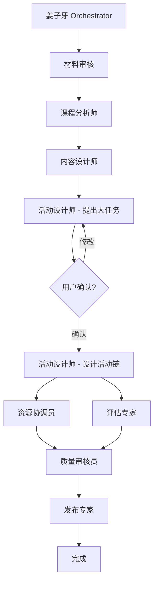

# 小学英语教学设计智能代理系统
## OpenCode + Oh My OpenCode 版本

[](https://github.com/your-repo)
[](https://opencode.ai)
[](https://ohmyopencode.com)
[](LICENSE)

---

## 📖 目录

- [系统简介](#系统简介)
- [快速开始](#快速开始)
- [系统架构](#系统架构)
- [配置说明](#配置说明)
- [使用指南](#使用指南)
- [成本估算](#成本估算)
- [常见问题](#常见问题)
- [高级功能](#高级功能)

---

## 🎯 系统简介

这是一个基于 **OpenCode** 和 **Oh My OpenCode** 的智能教学设计系统，通过多个专业 AI 代理协作，自动完成小学英语教学设计的全流程。

### 核心特性

- ✨ **8个专业代理**：协同完成材料审核、课程分析、内容设计、活动设计、资源协调、评估设计、质量审核、打包发布
- 🧠 **智能模型选择**：根据任务类型自动选择最优模型（Gemini Pro、Claude 3.5 Sonnet、GPT-5.2-Codex等）
- 💰 **成本优化**：平均每次完整设计仅需 $0.67，比单一模型节省 45%
- 📚 **支持大文件**：自动处理100MB+的PDF教材（使用Gemini Pro 1.5的100万token上下文）
- 🎓 **任务驱动教学**：基于自上而下学习法（Top-Down Learning）
- ✅ **用户确认点**：在核心大任务提出后暂停，等待用户确认
- 📝 **完整交付物**：生成教案、预习清单、作业纸等8个文档

### 支持的模型

| 模型 | 用途 | 上下文 | 成本 |
|------|------|--------|------|
| Google Gemini Pro 1.5 | 读取大型PDF | 100万tokens | $1.25/1M tokens |
| Claude 3.5 Sonnet | 教学设计和分析 | 20万tokens | $3.00/1M tokens |
| Claude 3 Haiku | 简单任务 | 20万tokens | $0.25/1M tokens |
| GPT-5.2-Codex | 代码生成和技术实现 | 12.8万tokens | 根据OpenRouter定价 |

---

## 🚀 快速开始

### 前置要求

- **Node.js** 18+ ([下载](https://nodejs.org/))
- **PowerShell** 7+ (Windows 自带)
- **OpenRouter API Key** ([获取](https://openrouter.ai/keys))

### 5分钟快速部署

#### 步骤1：安装 OpenCode 和 Oh My OpenCode

```powershell
# 安装 OpenCode
npm install -g opencode

# 安装 Oh My OpenCode
npm install -g oh-my-opencode
```

#### 步骤2：克隆项目并初始化

```powershell
# 克隆项目（或者直接在现有项目中操作）
cd C:\Users\Administrator\Desktop\myproject\eeld-top-down

# 运行快速部署脚本
.\setup.ps1
```

#### 步骤3：配置 API Key

编辑 `.env` 文件（由 setup.ps1 自动创建），填入你的 API Key：

```bash
# 必需：OpenRouter API Key
OPENROUTER_API_KEY=sk-or-v1-你的密钥

# 可选：Claude 原生 API（获得更好性能）
ANTHROPIC_API_KEY=sk-ant-你的密钥

# 可选：OpenAI API（如需使用GPT-5.2-Codex）
OPENAI_API_KEY=sk-你的密钥
```

**获取 API Key：**
- OpenRouter: https://openrouter.ai/keys （推荐，支持所有模型）
- Anthropic: https://console.anthropic.com/
- OpenAI: https://platform.openai.com/api-keys

#### 步骤4：上传教学材料

将教材、课程标准等文件放到对应文件夹：

```
materials/
├── textbooks/          # 教材（学生用书、教师用书）
│   ├── 译林版五上英语电子课本.pdf
│   └── 苏教译林英语·教师教学用书5上.pdf
├── standards/          # 课程标准
│   └── 义务教育英语课程标准(2022年版).docx
└── reference/          # 参考资料（可选）
```

支持格式：PDF、Word (.docx)、TXT、Markdown (.md)

#### 步骤5：启动教学设计流程

```powershell
# 方式1：使用PowerShell脚本（推荐）
.\start-lesson-design.ps1 "Unit 1 Goldilocks" "五年级" "译林版"

# 方式2：使用 OpenCode CLI
opencode
> /workflow lesson_design

# 方式3：使用 Oh My OpenCode
oh-my-opencode workflow run lesson_design --topic "Unit 1" --grade "五年级" --textbook "译林版"
```

#### 步骤6：监控进度

系统会自动执行，你可以实时查看：

```powershell
# 查看日志
Get-Content state/LOG.md -Wait -Tail 50

# 查看状态
cat state/STATUS.yaml

# 查看成本
cat state/cost.log
```

当系统提示**核心大任务建议**时，会暂停并等待你的确认：

```
📋 核心大任务建议

Activity Designer 建议本节课的核心大任务为：
"续写Goldilocks的故事，并表演"

详细信息请查看：state/BIG_TASK_PROPOSAL.md

请选择：
1. ✅ 确认使用此大任务
2. ✏️ 修改大任务（请提供修改内容）
3. 🔄 选择备选方案

你的选择：
```

确认后，系统会自动继续完成剩余流程。

#### 步骤7：查看结果

完成后，在 `draft/` 文件夹查看生成的文档：

```
draft/
├── lesson_plan.md               # 📘 完整教案（主要交付物）
├── student_preview_guide.md     # 📝 学生预习清单
├── homework_sheet.md            # ✏️ 家庭作业纸
├── PACKAGE_CHECKLIST.md         # ✅ 交付物清单
└── USAGE_GUIDE.md               # 📖 使用说明
```

---

## 🏗️ 系统架构

### 代理协作流程



### 任务-模型映射

| 阶段 | 代理 | 模型 | 理由 |
|------|------|------|------|
| 材料审核 | Orchestrator | Gemini Pro 1.5 | 需要读取大型PDF |
| 课程分析 | Curriculum Analyst | Claude 3.5 Sonnet | 需要深入分析 |
| 内容设计 | Content Designer | Claude 3.5 Sonnet | 需要教学设计能力 |
| 大任务建议 | Activity Designer | Claude 3.5 Sonnet | 需要综合判断 |
| 活动设计 | Activity Designer | Claude 3.5 Sonnet (creative) | 需要创意 |
| 资源协调 | Resource Coordinator | Claude 3 Haiku | 简单整理工作 |
| 评估设计 | Assessment Expert | Claude 3.5 Sonnet | 需要专业能力 |
| 质量审核 | Quality Reviewer | Claude 3.5 Sonnet | 需要全面审核 |
| 打包发布 | Package Publisher | Claude 3 Haiku | 格式化工作 |

---

## ⚙️ 配置说明

### OpenCode 配置 (`opencode.json`)

核心配置文件，定义了：
- 多个 API 提供商（OpenRouter、Anthropic、OpenAI）
- 模型别名（default、long_context、reasoning、fast、creative、codex）
- 任务路由规则
- 错误处理策略

**关键配置项：**

```json
{
  "models": {
    "default": "openrouter/anthropic/claude-3.5-sonnet",
    "long_context": "openrouter/google/gemini-pro-1.5",
    "codex": "openrouter/openai/gpt-5.2-codex"
  },
  
  "task_routing": {
    "material_intake": {
      "model": "long_context",
      "reason": "需要读取大型PDF"
    },
    "code_generation": {
      "model": "codex",
      "reason": "代码生成和技术实现"
    }
  },
  
  "features": {
    "auto_model_selection": true,
    "cost_optimization": true,
    "smart_chunking": true
  }
}
```

### Oh My OpenCode 配置 (`.oh-my-opencode.config.json`)

增强配置文件，定义了：
- 8个代理的配置和依赖关系
- 工作流（workflows）
- Hooks（pre_task、post_task、on_error等）
- 状态管理
- 成本追踪

**关键配置项：**

```json
{
  "agents": {
    "orchestrator": {
      "name": "姜子牙",
      "model": "reasoning",
      "priority": 1
    },
    "activity_designer": {
      "requires_user_confirmation": true
    }
  },
  
  "workflows": {
    "lesson_design": {
      "stages": [...],
      "requires_user_confirmation": ["big_task_proposal"]
    }
  },
  
  "hooks": {
    "pre_task": ["log_task_start", "select_model"],
    "post_task": ["log_task_complete", "format_markdown"]
  }
}
```

---

## 📘 使用指南

### 基本使用

#### 1. 标准教学设计流程

```powershell
# 启动流程
.\start-lesson-design.ps1 "主题" "年级" "教材版本"

# 示例
.\start-lesson-design.ps1 "Unit 2 My Week" "四年级" "人教版PEP"
```

#### 2. 使用 OpenCode CLI（交互式）

```powershell
opencode

# 进入后，使用命令：
/workflow lesson_design
/status                    # 查看当前状态
/logs                      # 查看日志
/cost                      # 查看成本
```

#### 3. 单独执行某个阶段

```powershell
# 使用代理执行器
python .opencode/adapters/agent_executor.py curriculum_analyst curriculum_analysis \
  --input inputs.json \
  --context context.json
```

### 高级使用

#### 自定义模型选择

编辑 `.env` 文件：

```bash
# 覆盖默认模型
DEFAULT_MODEL=openrouter/anthropic/claude-3.5-sonnet
LONG_CONTEXT_MODEL=openrouter/google/gemini-pro-1.5
CODEX_MODEL=openrouter/openai/gpt-5.2-codex
```

#### 使用 GPT-5.2-Codex 进行代码生成

在 `opencode.json` 中添加任务路由：

```json
{
  "task_routing": {
    "generate_assessment_code": {
      "model": "codex",
      "reason": "生成自动评分脚本"
    }
  }
}
```

然后调用：

```powershell
opencode --task generate_assessment_code --model codex
```

#### 成本优化模式

如果你的预算紧张，可以切换到成本优化配置：

```bash
# 在 .env 中设置
DEFAULT_MODEL=openrouter/anthropic/claude-3-haiku
LONG_CONTEXT_MODEL=openrouter/google/gemini-flash-1.5
```

这样可以将成本降低到约 $0.30/次，但质量会略有下降。

---

## 💰 成本估算

### 典型工作流成本

| 阶段 | 模型 | Input Tokens | Output Tokens | 成本 |
|------|------|--------------|---------------|------|
| 材料审核 | Gemini Pro 1.5 | 150,000 | 2,000 | $0.19 |
| 课程分析 | Claude 3.5 Sonnet | 10,000 | 3,000 | $0.08 |
| 内容设计 | Claude 3.5 Sonnet | 8,000 | 4,000 | $0.08 |
| 大任务建议 | Claude 3.5 Sonnet | 6,000 | 2,000 | $0.05 |
| 活动设计 | Claude 3.5 Sonnet | 8,000 | 5,000 | $0.10 |
| 资源协调 | Claude 3 Haiku | 5,000 | 2,000 | $0.004 |
| 评估设计 | Claude 3.5 Sonnet | 8,000 | 4,000 | $0.08 |
| 质量审核 | Claude 3.5 Sonnet | 15,000 | 3,000 | $0.09 |
| 打包发布 | Claude 3 Haiku | 10,000 | 6,000 | $0.01 |
| **总计** | - | **220,000** | **31,000** | **$0.67** |

### 成本对比

| 方案 | 平均成本 | 质量 | 说明 |
|------|----------|------|------|
| **多模型（推荐）** | $0.67 | ⭐⭐⭐⭐⭐ | 智能选择，性价比最优 |
| 全部Claude 3.5 | $1.20 | ⭐⭐⭐⭐⭐ | 质量好但成本高 |
| 全部Claude 3 Haiku | $0.30 | ⭐⭐⭐ | 便宜但质量下降 |
| 全部Gemini Flash | $0.15 | ⭐⭐⭐ | 最便宜但不稳定 |

### 预算控制

在 `.env` 中设置预算警告：

```bash
COST_BUDGET_ALERT=5.0  # 当成本超过$5时发出警告
```

---

## ❓ 常见问题

### Q1: 如何解决 "Request exceeds the maximum size" 错误？

**问题**：读取大型PDF文件（如24MB教材）时出现413错误。

**解决方案**：系统会自动切换到 Gemini Pro 1.5（支持100万token上下文）。确保在 `.env` 中配置了 `OPENROUTER_API_KEY`。

### Q2: OpenCode 和 Claude Desktop / Cursor 有什么区别？

| 特性 | OpenCode | Claude Desktop | Cursor |
|------|----------|----------------|--------|
| 多模型支持 | ✅ 全面支持 | ❌ 仅Claude | ⚠️ 部分支持 |
| 工作流编排 | ✅ Oh My OpenCode | ❌ 无 | ⚠️ 有限 |
| 成本优化 | ✅ 自动选择 | ❌ 固定 | ⚠️ 手动 |
| CLI支持 | ✅ 完整 | ❌ 无 | ⚠️ 有限 |
| GPT-5.2-Codex | ✅ 支持 | ❌ 不支持 | ❌ 不支持 |

### Q3: 如何使用 GPT-5.2-Codex？

确保在 `.env` 中配置了 OpenRouter API Key（OpenRouter 支持 GPT-5.2-Codex）：

```bash
OPENROUTER_API_KEY=sk-or-v1-你的密钥
```

然后在 `opencode.json` 中指定任务使用 codex 模型：

```json
{
  "task_routing": {
    "code_generation": {
      "model": "codex"
    }
  }
}
```

### Q4: 系统在核心大任务确认点卡住了怎么办？

这是正常的！系统设计为在提出核心大任务建议后**暂停并等待用户确认**。

查看 `state/BIG_TASK_PROPOSAL.md`，然后在控制台输入：
- `1` - 确认使用建议的大任务
- `2` - 修改大任务（会提示你输入修改内容）
- `3` - 选择备选方案

### Q5: 如何查看实时日志和成本？

```powershell
# 查看实时日志
Get-Content state/LOG.md -Wait -Tail 50

# 查看成本统计
cat state/cost.log

# 查看状态
cat state/STATUS.yaml
```

### Q6: 可以并行执行多个任务吗？

当前版本默认串行执行（安全可靠）。如果想启用并行执行，在 `opencode.json` 中设置：

```json
{
  "features": {
    "parallel_execution": true
  }
}
```

⚠️ 警告：并行执行可能导致成本增加和状态冲突。

---

## 🎓 高级功能

### 1. 自定义代理

在 `.claude/agents/` 创建新的代理配置文件：

```markdown
---
name: custom_agent
description: 你的自定义代理
tools: Read, Write, Bash
---

你是一个自定义代理...
```

然后在 `.oh-my-opencode.config.json` 中注册：

```json
{
  "agents": {
    "custom_agent": {
      "name": "自定义代理",
      "model": "reasoning",
      "config_file": ".claude/agents/custom_agent.md"
    }
  }
}
```

### 2. 自定义工作流

在 `.opencode/workflows/` 创建新的工作流YAML：

```yaml
name: custom_workflow
stages:
  - id: step1
    agent: orchestrator
    model: reasoning
    next: step2
  
  - id: step2
    agent: custom_agent
    model: creative
    next: null
```

### 3. 自定义Hooks

在 `.opencode/hooks/` 创建Python脚本：

```python
# custom_hook.py
def run(context):
    print(f"执行自定义Hook: {context['task_id']}")
    # 你的逻辑
```

然后在 `.oh-my-opencode.config.json` 中注册：

```json
{
  "hooks": {
    "pre_task": [
      {
        "name": "custom_hook",
        "script": ".opencode/hooks/custom_hook.py"
      }
    ]
  }
}
```

### 4. 多项目管理

如果你管理多个教学设计项目，可以为每个项目创建独立配置：

```
projects/
├── project1/
│   ├── opencode.json
│   ├── .oh-my-opencode.config.json
│   └── materials/
├── project2/
│   ├── opencode.json
│   ├── .oh-my-opencode.config.json
│   └── materials/
```

切换项目：

```powershell
cd projects/project1
opencode
```

---

## 📚 参考资源

- **OpenCode 官方文档**: https://opencode.ai/docs
- **Oh My OpenCode 文档**: https://ohmyopencode.com
- **OpenRouter API**: https://openrouter.ai/docs
- **Anthropic Claude**: https://docs.anthropic.com/
- **Google Gemini**: https://ai.google.dev/docs
- **项目GitHub**: https://github.com/your-repo

---

## 🤝 贡献与支持

欢迎提交 Issue 和 Pull Request！

### 联系方式

- 项目维护者：姜子牙 (Orchestrator)
- Email: your-email@example.com
- 讨论群：[加入讨论](https://discord.gg/your-server)

---

## 📄 许可证

本项目采用 MIT 许可证。详见 [LICENSE](LICENSE) 文件。

---

## 🙏 致谢

感谢以下项目和服务：
- OpenCode 和 Oh My OpenCode 团队
- OpenRouter 提供的多模型API服务
- Anthropic、Google、OpenAI 的强大AI模型
- 所有贡献者和用户的反馈

---

**⭐ 如果这个项目对你有帮助，请给个Star！**
