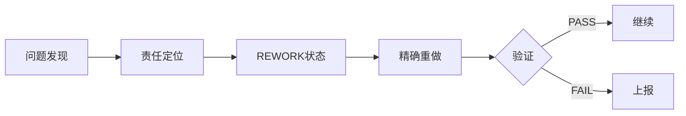
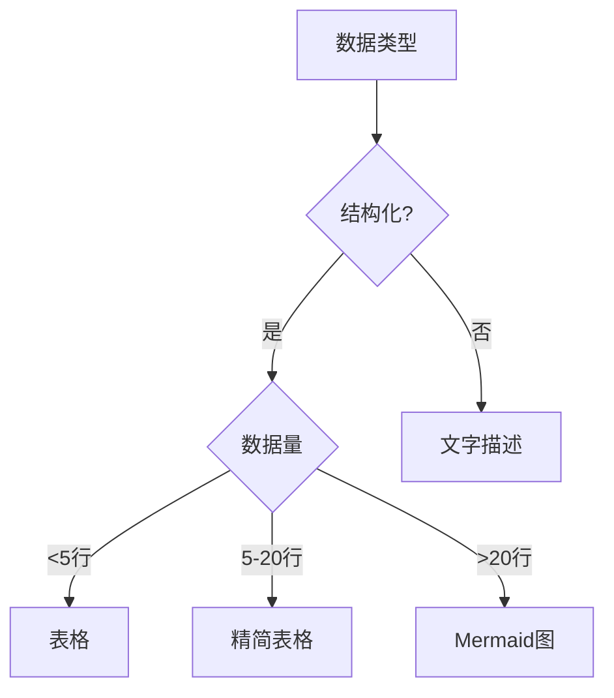

# 多代理系统设计原则 - 可迁移框架

## 一、核心设计理念

### 1.1 单一事实源原则
- **状态管理**：`state/` 目录是所有过程数据的唯一存储位置
- **日志中心化**：`state/LOG.md` 记录所有代理活动，形成完整时间线
- **配置分离**：`.claude/agents/` 存放行为定义，不存储执行数据
- **版本追踪**：所有修改追加而非覆盖，保持历史可查

### 1.2 透明度原则
- **内心独角戏**：每个代理记录思考过程，不只是结果
- **五幕结构**：登场→观察→思考→决策→执行，完整展现工作过程
- **失败记录**：诚实记录困惑、错误、返工，增加可信度
- **决策理由**：明确记录为什么选择A而非B

### 1.3 明确性原则
- **禁用模糊词**：不允许"约、大概、可能、建议"等模糊表达
- **精确计量**：3000字（不是"约3000"），16段（固定数量）
- **二值判断**：只用PASS/FAIL、YES/NO、TRUE/FALSE
- **强制验证**：每个输出都必须可自动验证

## 二、多代理协作架构

### 2.1 代理角色设计
```yaml
代理模板:
  角色定位:
    - 性格特征: [独特个性，便于识别]
    - 口头禅: [标志性表达]
    - 关注焦点: [核心职责]

  输入规范:
    - 必需文件: [明确列表]
    - 格式要求: [具体规范]
    - 前置条件: [依赖验证]

  输出规范:
    - 产出文件: [精确路径]
    - 质量标准: [可验证指标]
    - 交接要求: [签名+校验]
```

### 2.2 交接协议
```yaml
交接清单:
  产出物:
    - 文件路径: [精确位置]
    - 完成状态: COMPLETED/BLOCKED
    - MD5校验: [防篡改]

  验证项:
    - 必填字段: 100%完成
    - 数值精确: 无模糊项
    - 链接有效: 全部验证

  责任签名: agent_YYYYMMDD_HHMMUTC
```

### 2.3 返工机制


## 三、状态机管理

### 3.1 状态定义
```yaml
状态类型:
  WAITING: 等待依赖
  IN_PROGRESS: 执行中
  COMPLETED: 已完成
  BLOCKED: 阻塞
  REWORK: 返工中

禁止状态:
  - 基本完成
  - 差不多了
  - TODO
```

### 3.2 依赖管理
- **显式依赖**：每个任务明确列出前置条件
- **自动检查**：系统验证依赖是否满足
- **阻塞处理**：依赖未满足时自动阻塞
- **并行识别**：无依赖冲突的任务可并行

## 四、质量保证体系

### 4.1 自动验证
```python
验证规则:
  - 文件存在性: os.path.exists()
  - 字数统计: len(text) >= requirement
  - 格式合规: regex validation
  - 链接可达: curl/requests check
  - 签名完整: format verification
```

### 4.2 守门条件
- **硬性指标**：必须100%满足，否则返工
- **软性建议**：可以降级处理，但需记录
- **人工确认**：关键节点需要人工签字
- **追溯机制**：每个决定都能找到责任人

## 五、可视化策略

### 5.1 智能图表选择


### 5.2 图片处理原则
- **用户优先**：用户提供的图片智能放置
- **按需生成**：只在必要时创建图表
- **避免占位**：禁止无意义的空白占位符
- **直接嵌入**：Mermaid代码直接写入Markdown

## 六、日志系统设计

### 6.1 剧本式记录
```markdown
===== [时间戳] | [代理名] 登场 =====
【登场】自我介绍，任务理解
【观察】输入材料，环境状态
【思考】内心独白，困惑疑问
【决策】选择理由，放弃方案
【执行】具体动作，产出结果
【交接】验证清单，责任签名
=====
```

### 6.2 记录原则
- **真实性**：包括失败和困惑
- **完整性**：五幕不可缺少
- **可读性**：像故事一样生动
- **实用性**：便于问题追踪

## 七、异常处理机制

### 7.1 异常分类
```yaml
HARD_BLOCK:
  定义: 无法继续的致命问题
  处理: 必须上报用户

SOFT_BLOCK:
  定义: 可降级处理的问题
  处理: 记录并尝试降级

WARNING:
  定义: 不影响主流程的问题
  处理: 记录但继续执行
```

### 7.2 降级策略
- **明确条件**：什么情况允许降级
- **用户授权**：重要降级需用户批准
- **自动降级**：次要问题自动处理
- **详细记录**：降级原因和影响

## 八、可迁移性设计

### 8.1 任务无关组件
- **状态机引擎**：可用于任何多步骤任务
- **交接协议**：适用于任何代理间协作
- **验证框架**：可配置的规则引擎
- **日志系统**：通用的审计追踪

### 8.2 任务相关配置
```yaml
任务配置:
  domain: [领域，如blog/code/report]
  agents: [代理列表及角色]
  outputs: [最终产出物]
  quality: [质量指标]

可替换部分:
  - 代理角色和职责
  - 具体验证规则
  - 输出格式要求
  - 领域特定术语
```

## 九、系统优势总结

### 9.1 透明度
- 每个决策都有记录
- 思考过程完全可见
- 失败原因可追溯
- 改进方向明确

### 9.2 可靠性
- 自动验证减少错误
- 返工机制保证质量
- 签名制度明确责任
- 状态机防止遗漏

### 9.3 可扩展性
- 代理可增减调整
- 规则可配置修改
- 流程可并行优化
- 系统可跨域迁移

## 十、迁移检查清单

迁移到新任务时，需要：

### 10.1 保留的核心组件
- [ ] 状态机管理系统
- [ ] 交接验证协议
- [ ] 日志记录框架
- [ ] 返工处理机制
- [ ] 自动验证引擎

### 10.2 需要调整的部分
- [ ] 代理角色定义（根据新任务）
- [ ] 质量指标（如字数→代码行数）
- [ ] 验证规则（如链接检查→语法检查）
- [ ] 输出格式（如Markdown→Python）

### 10.3 领域特定配置
- [ ] 专业术语映射
- [ ] 行业规范要求
- [ ] 特殊验证逻辑
- [ ] 交付物标准

## 十一、最佳实践建议

### 11.1 启动新项目
1. 复制核心框架文件
2. 定义领域特定代理
3. 配置质量指标
4. 编写验证规则
5. 测试返工流程

### 11.2 优化建议
- **小步迭代**：先实现基础流程，再优化
- **早期验证**：尽早加入自动验证
- **充分日志**：宁可过度记录
- **用户参与**：关键决策征求确认

### 11.3 避免的陷阱
- 不要省略内心独白
- 不要跳过验证步骤
- 不要使用模糊表达
- 不要删除历史记录

## 十二、技术栈无关性

系统设计与具体技术栈无关，可适配：
- **语言**：Python/JavaScript/Java/Go等
- **框架**：任何支持文件操作的框架
- **平台**：云端/本地/混合部署
- **接口**：CLI/API/Web界面

核心是设计理念和协作模式，而非具体实现。

---

通过遵循以上设计原则，可以构建出透明、可靠、可扩展的多代理协作系统，适用于各种复杂任务的自动化处理。
