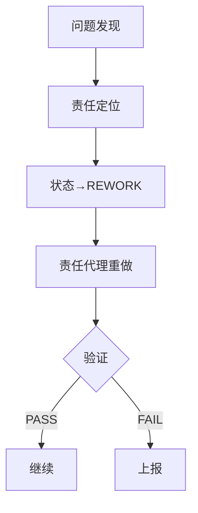

# 项目验证检查清单

## 一、逻辑一致性检查

### 核心要求一致性
| 检查项 | CLAUDE.md | WRITING_SPEC.md | 各代理配置 | 状态 |
|--------|-----------|-----------------|------------|------|
| 字数要求 | 3000字精确 | 3000字以上 | writer: 3000+ | ✓ 一致 |
| 段落数量 | 16段固定 | 16段结构 | outliner: 16段 | ✓ 一致 |
| 每段字数 | 150-200字 | 150-200字 | 150-200字 | ✓ 一致 |
| 设问数量 | 10-15个精确 | 10-15个 | 10-15个 | ✓ 一致 |
| 第二人称 | ≥20次精确 | 至少20次 | ≥20次 | ✓ 一致 |

### 交接流程一致性
| 流程 | 定义位置 | 验证机制 | 状态 |
|------|---------|---------|------|
| Stylist→Coordinator | AGENT_HANDOFF_PROTOCOL.md | 自动验证+签名 | ✓ 明确 |
| Coordinator→Researcher | AGENT_HANDOFF_PROTOCOL.md | 自动验证+签名 | ✓ 明确 |
| Researcher→Outliner | AGENT_HANDOFF_PROTOCOL.md | 自动验证+签名 | ✓ 明确 |
| Outliner→Writer | AGENT_HANDOFF_PROTOCOL.md | 自动验证+签名 | ✓ 明确 |
| Writer→Editor | AGENT_HANDOFF_PROTOCOL.md | 自动验证+签名 | ✓ 明确 |
| Editor→Publisher | AGENT_HANDOFF_PROTOCOL.md | 自动验证+签名 | ✓ 明确 |

## 二、输出规范明确性

### 必须产出文件
| 代理 | 必须产出 | 格式要求 | 验证方法 |
|------|----------|---------|---------|
| Stylist | state/STYLE_PROFILE.md | 完整无TODO | MD5校验 |
| Coordinator | state/MATERIAL_AUDIT.md<br>state/PUBLISH_PLAN.md | 所有字段填写 | 字段验证 |
| Researcher | state/RESEARCH_SUMMARY.md<br>state/SOURCES.md | 链接已验证 | URL可访问性 |
| Outliner | state/POST_OUTLINE.md | 16段明确定义 | 结构验证 |
| Writer | state/POST.md<br>draft/post.md | ≥3000字 | 字数统计 |
| Editor | state/ITERATIONS.md更新 | PASS/FAIL明确 | 二值验证 |
| Publisher | docs/status.md更新 | 发布就绪确认 | 状态验证 |

### 禁止的模糊表达
❌ **绝对禁止**：
- 约、大概、左右、可能、也许、或许
- 建议（除非在明确的建议章节）
- 待定、待补充、TODO（除待办清单）
- 如需、可选（必须明确YES/NO）

✅ **必须使用**：
- 精确数字：3050字（不是"3000字左右"）
- 明确状态：COMPLETED/BLOCKED/REWORK
- 具体时间：2025-01-18 10:00 UTC
- 二选一值：YES/NO、PASS/FAIL、TRUE/FALSE

## 三、返工机制验证

### 触发条件（明确定义）
1. **硬性失败**：
   - 字数 < 3000（精确统计）
   - 必需文件缺失（文件不存在）
   - 验证项包含NO（自动检测）

2. **质量失败**：
   - Editor标记FAIL（明确记录）
   - Publisher发现阻塞（具体描述）

### 返工流程


## 四、图像处理一致性

### 可视化策略统一
| 场景 | 处理方式 | 优先级 |
|------|---------|--------|
| 用户提供图片 | 智能放置到相关段落 | 1 |
| 复杂流程 | Mermaid流程图 | 2 |
| 数据对比 | 表格或Mermaid图表 | 3 |
| 简单概念 | 纯文字描述 | 4 |
| 装饰性图片 | 禁止使用 | × |

## 五、状态机一致性

### STATUS.yaml 规范
```yaml
agent_status:
  # 仅允许以下状态
  - WAITING      # 等待依赖
  - IN_PROGRESS  # 执行中
  - COMPLETED    # 已完成
  - BLOCKED      # 阻塞
  - REWORK       # 返工中

# 不允许的状态
  - 基本完成     # ❌
  - 差不多了     # ❌
  - TODO        # ❌
```

## 六、日志格式一致性

### 必须包含元素
1. **时间戳**：ISO 8601格式（2025-01-18T10:00:00Z）
2. **代理签名**：agent_YYYYMMDD_HHMMUTC
3. **验证结果**：PASS/FAIL（二选一）
4. **交接清单**：文件列表+MD5
5. **内心独角戏**：200-500字

### 示例格式验证
```markdown
===== 2025-01-18 10:00:00 UTC | Writer 交接 =====
【交接前自检】
□ 字数达标：3050字 ✓   # 精确数字
□ 段落完整：16段 ✓     # 固定数量
□ 设问数量：12个 ✓     # 精确统计
□ 引用有效：100% ✓     # 百分比

【验证结果】
自动验证：PASS         # 仅PASS/FAIL
人工复核：PASS         # 仅PASS/FAIL

【正式签名】
writer_20250118_1000UTC
=====
```

## 七、异常处理一致性

### 异常类型定义
| 类型 | 定义 | 处理 |
|------|------|------|
| HARD_BLOCK | 无法继续的致命问题 | 必须上报用户 |
| SOFT_BLOCK | 可降级处理的问题 | 记录并尝试降级 |
| WARNING | 不影响主流程的问题 | 记录但继续执行 |

### 降级方案（需用户批准）
1. 字数降级：3000→2800（需明确批准）
2. 段落降级：16→14（需明确批准）
3. 图表降级：Mermaid→文字（自动但需记录）

## 八、最终验证点

### 发布前必须通过
- [ ] 字数 ≥ 3000（wc统计）
- [ ] 段落 = 16（计数验证）
- [ ] 设问 10-15个（grep统计）
- [ ] 第二人称 ≥ 20次（grep统计）
- [ ] 所有链接可访问（curl验证）
- [ ] 无TODO/待定项（grep检查）
- [ ] 所有代理签名完整
- [ ] 交接验证100%通过

## 九、矛盾解决原则

当发现矛盾时的优先级：
1. AGENT_HANDOFF_PROTOCOL.md（最高优先级）
2. CLAUDE.md（项目主规范）
3. WRITING_SPEC.md（写作规范）
4. 各代理配置文件
5. 其他文档

## 十、自动化验证脚本

```python
def validate_blog_post(post_file):
    """完整性验证"""
    checks = {
        "word_count": lambda text: len(text) >= 3000,
        "paragraph_count": lambda text: text.count('\n\n') == 16,
        "question_marks": lambda text: 10 <= text.count('？') <= 15,
        "second_person": lambda text: text.count('你') >= 20,
        "no_todos": lambda text: 'TODO' not in text,
        "no_ambiguous": lambda text: all(word not in text
            for word in ['约', '大概', '左右', '可能', '待定'])
    }

    with open(post_file, 'r') as f:
        content = f.read()

    results = {}
    for check_name, check_func in checks.items():
        results[check_name] = "PASS" if check_func(content) else "FAIL"

    return all(r == "PASS" for r in results.values()), results
```

通过以上检查清单，确保：
1. **无歧义**：每个要求都有精确定义
2. **可验证**：每个输出都能自动验证
3. **可追溯**：每个问题都能定位责任
4. **可返工**：失败后能从准确位置重新开始
